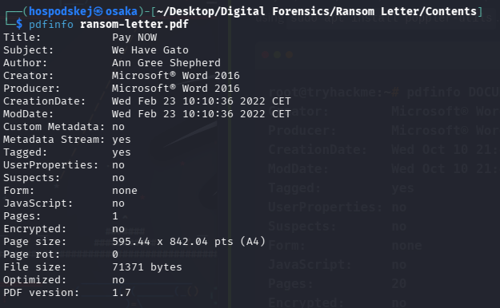
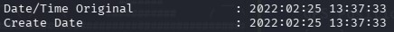
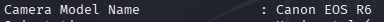
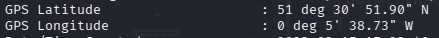

We have received a ransomware email containing an image and a .doc file with instructions. Luckily the attacker didn't scrape the metadata, allowing us to locate him.

We can convert the .doc file into a PDF file, which wouldn't alter the important metadata for this exercise, and utilize a tool called 'pdfinfo', allowing us to extract information about the file's origins.

With this information we can see when the file was created and who is the attacker responsible for Gato's kidnapping.

Next, we can analyze the metadata of the attached picture of Gato using a tool called exiftool, which stands for Exchangeable Image File Format. 

The image metadata indicates a creation date 48 hours subsequent to the ransom note's creation date, letting us know that Gato was alive and well after the letter was created.. To help us track the attacker down, we can locate the metadata about the camera model and even the GPS location of where the picture was taken.

Using google maps we can see where the attacker is located, that being the Milk Street in London, so we can forward this information to the police and let them handle it.
